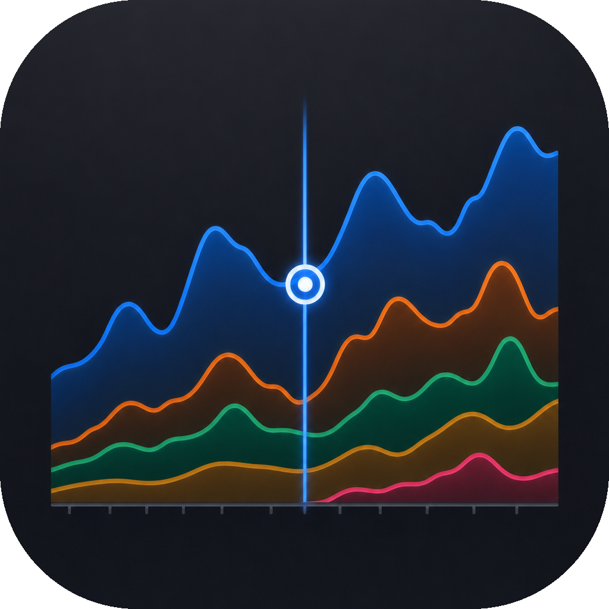
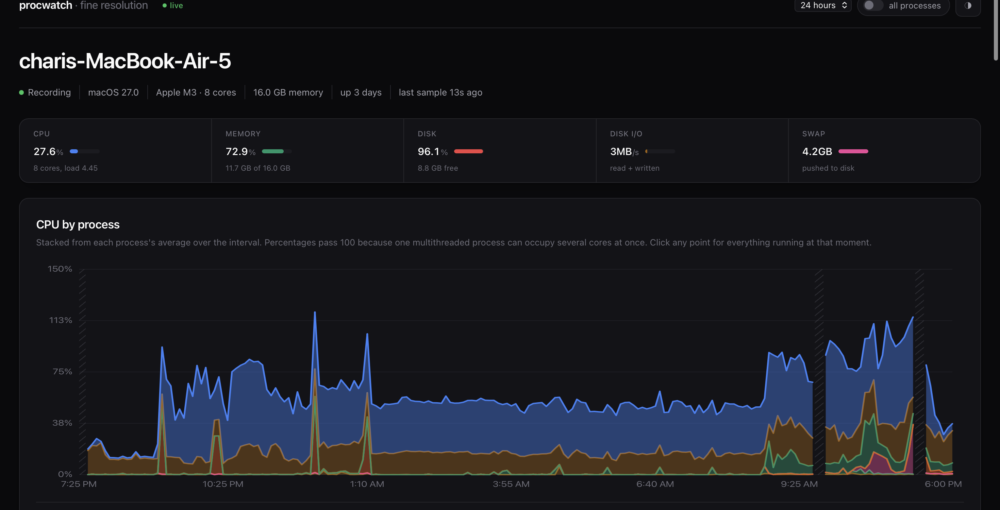

# Procwatch

**Per-process history for macOS.** Activity Monitor tells you what is slow
right now, then forgets. Procwatch remembers — so you can ask what ate the CPU
at 3am last Tuesday and get an answer.



No dependencies. macOS and Python 3.9+, nothing else. Around 110 MB of disk
once it settles, and it never grows past that.

---

## Install

```sh
curl -fsSL https://raw.githubusercontent.com/chari-dev/procwatch/main/install.sh | sh
```

That is the whole install. Prefer to read it first — you should:

```sh
curl -fsSLO https://raw.githubusercontent.com/chari-dev/procwatch/main/install.sh
less install.sh
sh install.sh
```

Or from a clone:

```sh
git clone https://github.com/chari-dev/procwatch
cd procwatch
sh install.sh
```

One script does everything: installs the tool to
`~/Library/Application Support/procwatch`, schedules the recorder to sample
every 30 seconds, and builds and installs the menu bar app. Nothing needs
`sudo`, and nothing is written outside your home directory and
`/Applications`. Run it again any time to upgrade in place.

Only the menu bar app needs developer tools. Without `swiftc` the installer
says so and carries on — you still get the recorder and the dashboard. Pass
`--no-app` to skip it deliberately.

**Remove it**, keeping everything recorded so far:

```sh
sh install.sh --uninstall
```

Your history is never deleted without being asked for: the uninstaller prints
where it is and leaves it there.

### Without the installer

`procwatch.py` is the whole tool in one file — every module and the dashboard
inlined, and the only file the installer actually installs. Take it from the
[latest release](https://github.com/chari-dev/procwatch/releases/latest) and
copy it anywhere with a Mac and a Python:

```sh
python3 procwatch.py install    # record every 30 seconds
python3 procwatch.py open       # dashboard in a browser
python3 procwatch.py status     # what is stored
```

Refer to it by full path if you move it. The scheduled job records where it
was installed from, and it refuses to schedule anything rather than schedule
a job that cannot run.

### Menu bar app


The installer puts it in `/Applications`, so it appears in Launchpad,
Spotlight and the app switcher. Its icon sits in your menu bar; click it for
the dashboard in a panel sized to a quarter of the screen, or use **Open in
browser** for the full-size version.

The app carries its own copy of Procwatch, so it runs wherever you drag it.
Swift with AppKit and WebKit — system frameworks, no Xcode project needed.
Quitting it stops the viewer, not the recorder.

---

## Using it

**The charts show the last 24 hours.** Scroll sideways on any chart to move
back through time; hold ⌘ and scroll to zoom. The indicator beside the title
turns from `live` to how far back you are looking — click it to snap back.

**Hover a process name** to pick it out of every chart at once. **Click** to
keep it picked out until you click it again or press Escape.

**Click any point on the CPU chart** to see everything that was running at
that moment — each process's average, its peak, the minute it peaked, memory,
and how many processes it had.

**The switch in the header** toggles between applications and everything.
With it off you see apps: Arc, Chrome, Spotify — each with its helpers folded
in, so a browser is one row rather than thirty. With it on you see every
process group the recorder tracks, daemons included.

**The gear** opens settings: how much time the charts show, how many
processes each one ranks, chart height, how often the live table refreshes,
and which charts appear at all. Settings live in your browser, not on the
machine — the recorder never needs the dashboard to be open.

**Below the charts** are the live process table, sortable by any column, with
**Quit** and **Force quit** per application; and every port currently being
listened on, with the process holding it.

---

## What it records

Every 30 seconds, per application:

| | |
|---|---|
| **CPU** | from `cputime` deltas — never `ps %cpu` |
| **Memory** | resident set and physical footprint |
| **Network** | bytes in and out, via `nettop` |
| **Disk** | bytes read and written, via `proc_pid_rusage` |
| **Energy** | as macOS bills it, shown as a share |
| **Battery** | charge, draw, and capacity |
| **Ports** | what is listening, and which process holds it |

Plus system-wide load, memory pressure, swap, free disk, and a calendar grid
of when the machine is busy by hour of day.

Nothing needs `sudo`.

---

## How long it keeps things

| Resolution | Kept for | Size |
|---|---|---|
| 30 seconds | 7 days | ~61 MB |
| 5 minutes | 30 days | ~26 MB |
| 1 hour | 1 year | ~26 MB |
| 6 hours | forever | +4 MB/year |

Older data coarsens rather than disappearing. A spike keeps its true height at
every resolution — a 61% burst lasting four minutes still reads 61% in a
six-hour bucket a year later, and still names the minute it peaked.

`python3 -m procwatch.cli status` reports what is actually stored.

### Backup and restore

```sh
python3 procwatch.py backup ~/Documents     # dated file in that directory
python3 procwatch.py restore <file>
```

Or **Download a backup** in settings.

A backup is one SQLite file, snapshotted while the recorder keeps writing —
not a copy of the file, which would catch a write half-made. Restore describes
both databases and asks before replacing anything, keeps a copy of the one it
replaces, and refuses a file that is not a Procwatch database rather than
finding out afterwards.

---

## Why some things are the way they are

**CPU is not `ps %cpu`.** That column is a decaying average over an opaque
window (`man ps`), its fields are documented to sum past 100%, and it cannot
be integrated across time buckets. Rates come from differencing cumulative CPU
time instead.

**Rolled-up rows keep a maximum, not just an average.** A 61% spike lasting
four minutes, averaged into an hour, reads as 4% — erasing exactly the event
this exists to record. Every row carries `cpu_max` and the timestamp of the
peak.

**Gaps are drawn, not smoothed over.** A laptop sleeps. Hours where nothing
was sampled render hatched, and no line is drawn across them. Asleep and idle
are different facts.

**Energy is a percentage.** macOS bills energy in an undocumented unit whose
implied rate is not a plausible wattage, so an absolute figure would be a
guess wearing a unit. A share is exact — the units cancel.

**"Not responding" is called "waiting".** macOS has no supported way to ask
whether an app is servicing its run loop; Activity Monitor uses a private
interface. What is measured is uninterruptible wait, so that is what it says.

---

## Layout

```
procwatch/
  config.py      retention tiers and paths
  psreader.py    two ps calls, positional parsing
  rusage.py      disk and energy via libproc
  netstat.py     per-process network, listening ports
  identity.py    argv -> a stable key; application resolution
  sampler.py     one tick: read, difference, aggregate, write
  rollup.py      collapse tiers, preserving maxima
  query.py       read side
  live.py        instantaneous reads that write nothing
  server.py      local HTTP, CSRF-guarded actions
  static/        the dashboard, one self-contained page
menubar/         Swift status-bar app
tools/bundle.py  fold everything into procwatch.py
```

`docs/superpowers/specs/` holds the design document, including the tier
arithmetic and the failure modes it is built against.

---

## Contributing

See [CONTRIBUTING.md](CONTRIBUTING.md). In short: stdlib only, write the
failing test first, and prefer failing loudly over recording a plausible
wrong number.

```sh
python3 -m unittest discover -s tests
```

## Licence

MIT — see [LICENSE](LICENSE).
